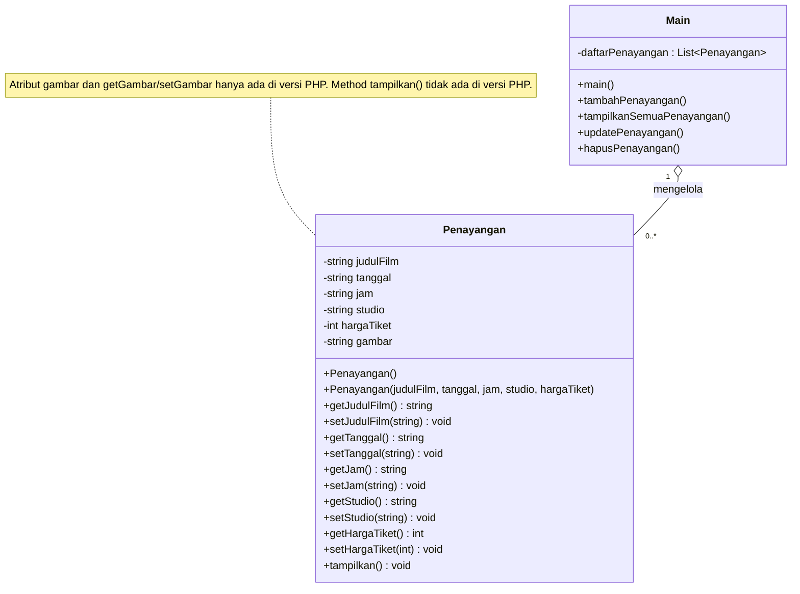
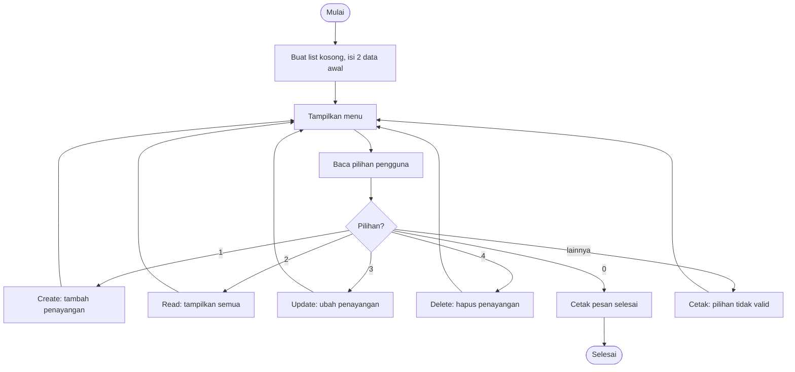
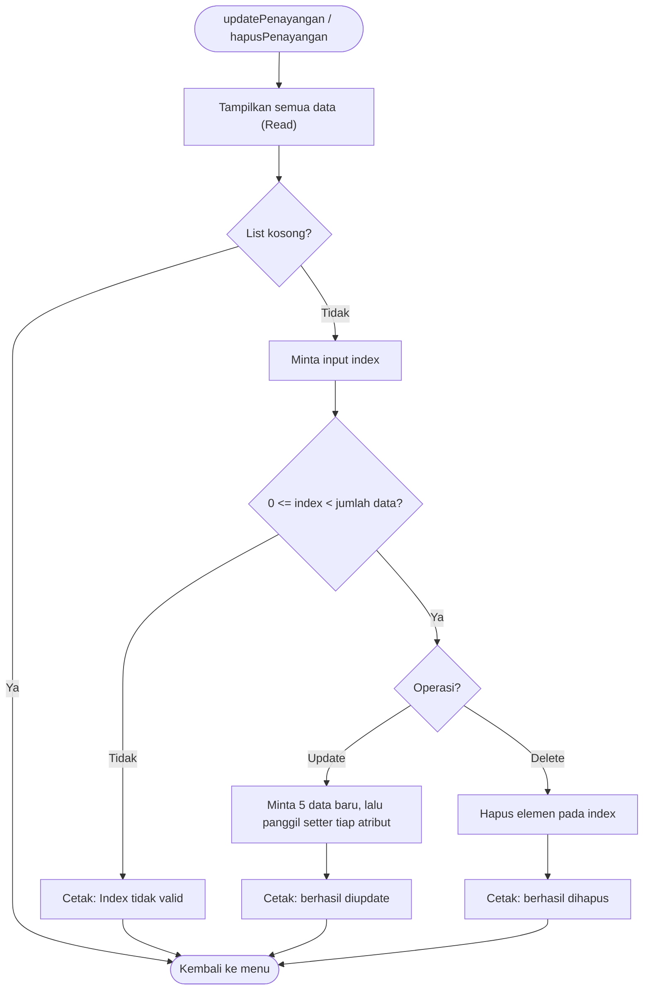
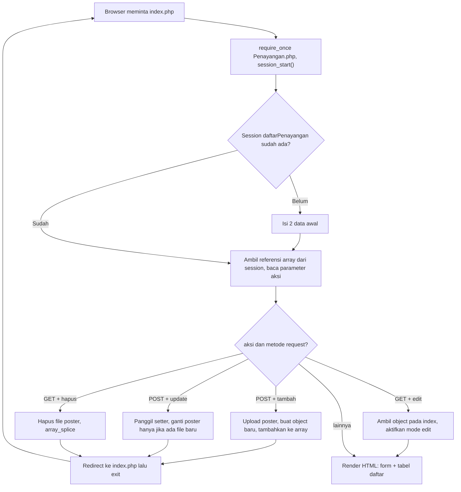

# TP1DPBO2526C2 — Pengelolaan Penayangan Bioskop

```
Saya Mohammad Arya Dhinata dengan NIM 2504992 mengerjakan kuis 1 dalam mata kuliah Desain 
Pemrograman Berbasis Objek untuk keberkahan-Nya maka saya tidak melakukan kecurangan seperti 
yang di spesifikasikan. Aamin
```

Tugas Praktikum 1 (DPBO 2025/2026, kelas C2): program **CRUD** (Create, Read, Update, Delete) untuk mengelola data **penayangan film di bioskop**, diimplementasikan dengan pendekatan **Pemrograman Berorientasi Objek** dalam **4 bahasa**: C++, Java, Python, dan PHP.

Keempat implementasi punya desain yang sama: satu class `Penayangan` sebagai *model* data, dan satu file utama yang mengatur menu serta operasi CRUD.

---

## Daftar Isi

1. [Struktur Folder](#1-struktur-folder)
2. [Desain Program](#2-desain-program)
3. [Alur Kode](#3-alur-kode)
4. [Cara Menjalankan](#4-cara-menjalankan)
5. [Dokumentasi Screenshot](#5-dokumentasi-screenshot)
6. [Catatan dan Batasan](#6-catatan-dan-batasan)

---

## 1. Struktur Folder

```
TP1DPBO2526C2/
├── README.md
├── Cpp/
│   ├── Penayangan.cpp        # class Penayangan
│   ├── Main.cpp              # menu + CRUD (meng-include Penayangan.cpp)
│   └── Main.exe, *.o         # hasil kompilasi
├── Java/
│   ├── Penayangan.java       # class Penayangan
│   ├── Main.java             # menu + CRUD
│   └── *.class               # hasil kompilasi
├── Python/
│   ├── Penayangan.py         # class Penayangan
│   ├── Main.py               # menu + CRUD
│   └── __pycache__/          # cache bytecode
├── PHP/
│   ├── Penayangan.php        # class Penayangan (+ atribut gambar)
│   ├── index.php             # controller + tampilan (form & tabel)
│   ├── Style.css             # styling halaman
│   └── Asset/                # penyimpanan file poster (upload lokal)
└── Dokumentasi/
    ├── CPP/                  # screenshot C++
    ├── Java/                 # screenshot Java
    ├── Python/               # screenshot Python
    └── PHP/                  # screenshot PHP
```

---

## 2. Desain Program

### 2.1 Konsep OOP yang Digunakan

| Konsep | Penerapan |
|---|---|
| **Class & Object** | `Penayangan` merepresentasikan satu jadwal tayang. Setiap data yang ditambahkan menjadi satu *object*. |
| **Enkapsulasi** | Atribut dibuat `private` (C++, Java, PHP) dan diakses lewat *getter/setter*. Di Python atribut bersifat publik menurut konvensi, tetapi getter/setter tetap disediakan agar desainnya seragam. |
| **Konstruktor** | C++ dan Java punya dua konstruktor (default dan berparameter). Python dan PHP memakai satu konstruktor dengan nilai default parameter. |
| **Pemisahan tanggung jawab** | `Penayangan` hanya mengurus data dan cara menampilkannya. Logika menu, input, dan CRUD ada di file terpisah (`Main` / `index.php`). |
| **Koleksi object** | Kumpulan object disimpan dalam struktur koleksi bawaan tiap bahasa (lihat 2.5). |

### 2.2 Class `Penayangan`

**Atribut**

| Atribut | Tipe | Keterangan |
|---|---|---|
| `judulFilm` | string | Judul film yang ditayangkan |
| `tanggal` | string | Tanggal tayang, format `YYYY-MM-DD` |
| `jam` | string | Jam tayang, format `HH:MM` |
| `studio` | string | Nama studio, contoh `Studio 1` |
| `hargaTiket` | int | Harga tiket dalam rupiah |
| `gambar` | string | **Khusus PHP.** Path file poster di folder `Asset/` |

**Method**

| Method | Fungsi |
|---|---|
| Konstruktor | Membuat object; versi default mengisi string kosong dan harga `0` |
| `getXxx()` / `setXxx()` | Membaca / mengubah tiap atribut |
| `tampilkan()` | Mencetak seluruh atribut ke konsol (C++, Java, Python). Versi PHP tidak punya method ini karena data ditampilkan lewat tabel HTML. |
| Destruktor `~Penayangan()` | Hanya ada di C++ (kosong) |

### 2.3 Class Diagram



### 2.4 Pembagian Tanggung Jawab

| Lapisan | Berkas | Tugas |
|---|---|---|
| **Model** | `Penayangan.*` | Menyimpan data satu penayangan dan menyediakan akses lewat getter/setter |
| **Controller + View (CLI)** | `Main.*` | Menampilkan menu, membaca input, memanggil operasi CRUD, mencetak hasil |
| **Controller + View (Web)** | `index.php` | Membaca `?aksi=`, memproses form, lalu merender HTML |

### 2.4.1 Fungsi CRUD di Setiap Bahasa

| Operasi | C++ | Java | Python | PHP |
|---|---|---|---|---|
| **Create** | `tambahPenayangan(vector&)` | `tambahPenayangan()` | `tambah_penayangan()` | `?aksi=tambah` (POST) |
| **Read** | `tampilkanSemuaPenayangan(vector&)` | `tampilkanSemuaPenayangan()` | `tampilkan_semua_penayangan()` | `foreach` pada tabel HTML |
| **Update** | `updatePenayangan(vector&)` | `updatePenayangan()` | `update_penayangan()` | `?aksi=edit` (GET, tampil form) lalu `?aksi=update` (POST) |
| **Delete** | `hapusPenayangan(vector&)` | `hapusPenayangan()` | `hapus_penayangan()` | `?aksi=hapus` (GET) |

### 2.5 Perbandingan Antar Bahasa

| Aspek | C++ | Java | Python | PHP |
|---|---|---|---|---|
| Penyimpanan data | `vector<Penayangan>` | `ArrayList<Penayangan>` | `list` | array di `$_SESSION` |
| Penghubung file | `#include "Penayangan.cpp"` | class terpisah, satu folder | `from Penayangan import Penayangan` | `require_once 'Penayangan.php'` |
| Penamaan | camelCase | camelCase | snake_case | camelCase |
| Kontrol menu | `do-while` + `switch` | `do-while` + `switch` | `while True` + `if/elif` | query string `?aksi=` |
| Cara input | `cin` + `getline` + `bersihkanBuffer()` | `Scanner.nextLine()` | `input()` | form HTML |
| Hapus elemen | `erase(begin() + i)` | `remove(i)` | `pop(i)` | `array_splice()` |
| Validasi index | `index < 0 \|\| index >= size` | sama | `try/except` + cek rentang | `isset($daftar[$i])` |

### 2.6 Penyimpanan Data

Tidak ada database maupun file data. Semua data hidup **di memori** selama program berjalan:

- **C++ / Java / Python:** disimpan dalam list/vector di memori. Data hilang saat program ditutup.
- **PHP:** disimpan dalam `$_SESSION['daftarPenayangan']`, sehingga bertahan antar-request selama session browser masih aktif. Hanya **file poster** yang benar-benar tersimpan di disk (folder `Asset/`), sedangkan path-nya dicatat di atribut `gambar`.

---

## 3. Alur Kode

### 3.1 Alur Utama (C++, Java, Python)

Program berjalan dalam satu loop menu yang terus berulang sampai pengguna memilih `0`.



Menu yang ditampilkan:

```
===== MENU PENGELOLAAN PENAYANGAN BIOSKOP =====
1. Tambah Penayangan (Create)
2. Tampilkan Semua Penayangan (Read)
3. Update Penayangan (Update)
4. Hapus Penayangan (Delete)
0. Keluar
```

### 3.2 Create

1. Program meminta lima input berurutan: judul, tanggal, jam, studio, harga tiket.
2. Object `Penayangan` baru dibuat dengan konstruktor berparameter.
3. Object ditambahkan ke akhir list (`push_back` / `add` / `append`).
4. Program mencetak `>> Data berhasil ditambahkan!`.

### 3.3 Read

1. Jika list kosong, cetak `(Belum ada data penayangan)` lalu kembali ke menu.
2. Jika ada isi, list ditelusuri dengan loop. Setiap elemen dicetak dengan label `[Index i]`, lalu memanggil `tampilkan()`.

### 3.4 Update dan Delete

Keduanya berpola sama; yang berbeda hanya langkah akhirnya.



Update **tidak membuat object baru**. Object yang sudah ada dimodifikasi lewat setter, sehingga memanfaatkan enkapsulasi.

### 3.5 Detail Khusus per Bahasa

**C++**
- `Main.cpp` langsung meng-`#include "Penayangan.cpp"`, jadi cukup mengompilasi `Main.cpp`.
- Vector dikirim **by reference** (`vector<Penayangan>&`) agar perubahan di dalam fungsi berlaku pada data asli.
- `bersihkanBuffer()` dipanggil setiap selesai `cin >> ...` supaya `getline` berikutnya tidak terlewat oleh karakter newline yang tersisa.

**Java**
- `Scanner` dan `ArrayList` dibuat sebagai field `static`, sehingga bisa dipakai bersama oleh semua method statis.
- Semua input dibaca dengan `nextLine()` lalu dikonversi dengan `Integer.parseInt(...)`. Cara ini menghindari masalah newline yang sering muncul jika `nextInt()` dicampur dengan `nextLine()`.

**Python**
- Data disimpan di list level modul `daftar_penayangan`.
- Entry point dilindungi `if __name__ == "__main__": main()`.
- Pada Update dan Delete, input index dibungkus `try/except ValueError`.

**PHP** (alur web, berbeda dari CLI)

Satu berkas `index.php` menangani semua aksi. Setelah setiap perubahan data, halaman melakukan **redirect** ke `index.php` (pola *Post/Redirect/Get*) supaya refresh browser tidak mengirim ulang form.



Poin penting alur PHP:

- **Satu form, dua mode.** Jika `?aksi=edit&index=N`, form terisi data lama dan mengirim ke `?aksi=update`. Jika tidak, form kosong dan mengirim ke `?aksi=tambah`.
- **Upload poster.** Fungsi `prosesUploadGambar()` menyimpan file ke `Asset/` dengan nama unik (`uniqid() . '_' . namaAsli`) dan mengembalikan path-nya. Path itulah yang disimpan di atribut `gambar`.
- **Delete** menghapus file poster dari disk (`unlink`) sebelum elemen array dibuang. Di browser muncul dialog `confirm()` terlebih dahulu.
- **Keamanan tampilan.** Semua data yang dicetak ke HTML dibungkus `htmlspecialchars()`, dan harga diformat dengan `number_format()` (contoh `50.000`).

---

## 4. Cara Menjalankan

**C++**
```bash
cd Cpp
g++ Main.cpp -o Main
./Main          # Windows: Main.exe
```

**Java**
```bash
cd Java
javac Main.java Penayangan.java
java Main
```

**Python**
```bash
cd Python
python Main.py  # atau: py Main.py / python3 Main.py
```

**PHP**
```bash
cd PHP
php -S localhost:8000
```
Lalu buka `http://localhost:8000` di browser. Pastikan folder `Asset/` bisa ditulis.

---

## 5. Dokumentasi Screenshot

### C++, Java, dan Python

| Skenario | C++ | Java | Python |
|---|---|---|---|
| Menu | [lihat](Dokumentasi/CPP/Menu.png) | [lihat](Dokumentasi/Java/Menu.png) | [lihat](Dokumentasi/Python/Menu.png) |
| Keluar | [lihat](Dokumentasi/CPP/MenuOut.png) | [lihat](Dokumentasi/Java/MenuOut.png) | [lihat](Dokumentasi/Python/MenuOut.png) |
| Read | [lihat](Dokumentasi/CPP/Read.png) | [lihat](Dokumentasi/Java/Read.png) | [lihat](Dokumentasi/Python/Read.png) |
| Create | [lihat](Dokumentasi/CPP/Create.png) | [lihat](Dokumentasi/Java/Create.png) | [lihat](Dokumentasi/Python/Create.png) |
| Read setelah Create | [lihat](Dokumentasi/CPP/ReadAfterCreate.png) | [lihat](Dokumentasi/Java/ReadAfterCreate.png) | [lihat](Dokumentasi/Python/ReadAfterCreate.png) |
| Update | [lihat](Dokumentasi/CPP/Update.png) | [lihat](Dokumentasi/Java/Update.png) | [lihat](Dokumentasi/Python/Update.png) |
| Read setelah Update | [lihat](Dokumentasi/CPP/ReadAfterUpdate.png) | [lihat](Dokumentasi/Java/ReadAfterUpdate.png) | [lihat](Dokumentasi/Python/ReadAfterUpdate.png) |
| Delete | [lihat](Dokumentasi/CPP/Delete.png) | [lihat](Dokumentasi/Java/Delete.png) | [lihat](Dokumentasi/Python/Delete.png) |
| Read setelah Delete | [lihat](Dokumentasi/CPP/ReadAfterDelete.png) | [lihat](Dokumentasi/Java/ReadAfterDelete.png) | [lihat](Dokumentasi/Python/ReadAfterDelete.png) |
| Error handling | [1](Dokumentasi/CPP/ErrorHandling/ErrorHandling1.png) · [2](Dokumentasi/CPP/ErrorHandling/ErrorHandling2.png) · [3](Dokumentasi/CPP/ErrorHandling/ErrorHandling3.png) | [1](Dokumentasi/Java/ErrorHandling/ErrorHandling1.png) · [2](Dokumentasi/Java/ErrorHandling/ErrorHandling2.png) · [3](Dokumentasi/Java/ErrorHandling/ErrorHandling3.png) | belum ada |

### PHP

| Skenario | Screenshot |
|---|---|
| Form tambah | [Form.png](Dokumentasi/PHP/Form.png) |
| Form tambah terisi | [CreteFormInput.png](Dokumentasi/PHP/CreteFormInput.png) |
| Daftar awal | [Daftar.png](Dokumentasi/PHP/Daftar.png) |
| Daftar setelah tambah | [DaftarAfterInput.png](Dokumentasi/PHP/DaftarAfterInput.png) |
| Form update (sebelum diubah) | [UpdateBefore.png](Dokumentasi/PHP/UpdateBefore.png) |
| Form update (setelah diubah) | [UpdateAfter.png](Dokumentasi/PHP/UpdateAfter.png) |
| Daftar setelah update | [DaftarAfterUpdate.png](Dokumentasi/PHP/DaftarAfterUpdate.png) |
| Konfirmasi hapus | [DeleteAlert.png](Dokumentasi/PHP/DeleteAlert.png) |
| Daftar setelah hapus | [DaftarAfterDelete.png](Dokumentasi/PHP/DaftarAfterDelete.png) |

---

## 6. Catatan dan Batasan

**Penanganan input per bahasa**

| Bahasa | Yang divalidasi | Yang belum ditangani |
|---|---|---|
| C++ | Pilihan menu di luar 0–4, index di luar rentang | Input non-angka pada `cin >> int` |
| Java | Pilihan menu di luar 0–4, index di luar rentang | `Integer.parseInt` melempar `NumberFormatException` jika input bukan angka |
| Python | Menu di luar 0–4, index non-angka (`ValueError`), index di luar rentang | `int(input(...))` pada harga tiket |
| PHP | Atribut `required` dan tipe `date`/`time`/`number` di form, `isset()` untuk index, dialog konfirmasi hapus | Error upload diabaikan diam-diam (poster tidak diganti) |

**Hal lain yang perlu diketahui**

- **Data tidak persisten.** Data hilang saat program (atau session PHP) berakhir.
- **Data awal berbeda antar bahasa.** C++ dan Java memakai *Avengers: Doomsday* dan *Spider-Man: Brand New Day* (2026). Python dan PHP memakai *Avengers: Endgame* dan *Spider-Man: No Way Home* (2023).
- **Penamaan berkas CSS.** Berkasnya bernama `Style.css`, sedangkan `index.php` me-link `style.css`. Di Windows ini berjalan normal, tetapi di Linux/macOS (case-sensitive) stylesheet tidak akan termuat kecuali salah satunya disamakan.
- **Menghapus data awal PHP** juga menghapus file poster bawaannya dari `Asset/`.
- **Artefak build** (`Main.exe`, `*.o`, `*.class`, `__pycache__/`) ikut berada di repositori. Sebaiknya ditambahkan ke `.gitignore`.
